# PepperPresentationIMERIRApp
Application developed for the Pepper robot, manufactured and marketed by the company Softbank Robotics, to present the IMERIR IT and robotics school during various events (trade fairs, open houses...)...

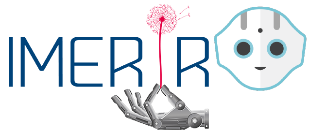

## Contents

1. [Introduction](#introduction),
2. [Presentation of this project](#presentation_of_this_project),
3. [Application's definition](#application_s_definition),
4. [Git repos's structure](#git_repos_s_structure),
5. [Project's components](#project_s_components),
6. [How was this project developed ?](#how_was_this_project_developed)
7. [How to install it ?](#how_to_install_it)
8. [Result](#result)
9. [Manual](#manual)
    * [How to start the application ?](#how_to_start_the_application)
    * [How to stop the application ?](#how_to_stop_the_application)
    * [Each answer for each question](#each_answer_for_each_question).
        * ["Que veux-tu savoir sur notre établissement ?"](#first_question)
        * ["Quel diplôme t'intéresse ?"](#second_question)
        * ["Comment souhaites-tu prendre contact avec nous ?"](#third_question)
        * ["Veux-tu en savoir plusse ?"](#fourth_question)
        * ["Souhaites-tu remplir le formulaire d'inscription ?"](#fifth_question)
        * ["Souhaites-tu voir des photos et vidéos de cérémonies ?"](#sixth_question)
        * ["L'IMÉRIR organise des sessions A R E; Veux-tu en savoir plusse ?"](#seventh_question)
        * ["Que veux-tu faire maintenant ? t'inscrire ? voir les partenaires ? ou rien ?"](#eighth_question)
10. [Issues and bugs](#issues_and_bugs),    
11. [Useful links](#useful_links),
12. [Conclusion](#conclusion).

## Introduction

IMERIR is an engineering school providing training in IT, connected objects, artificial intelligence, maker culture and robotics. By the way, here is its logo:

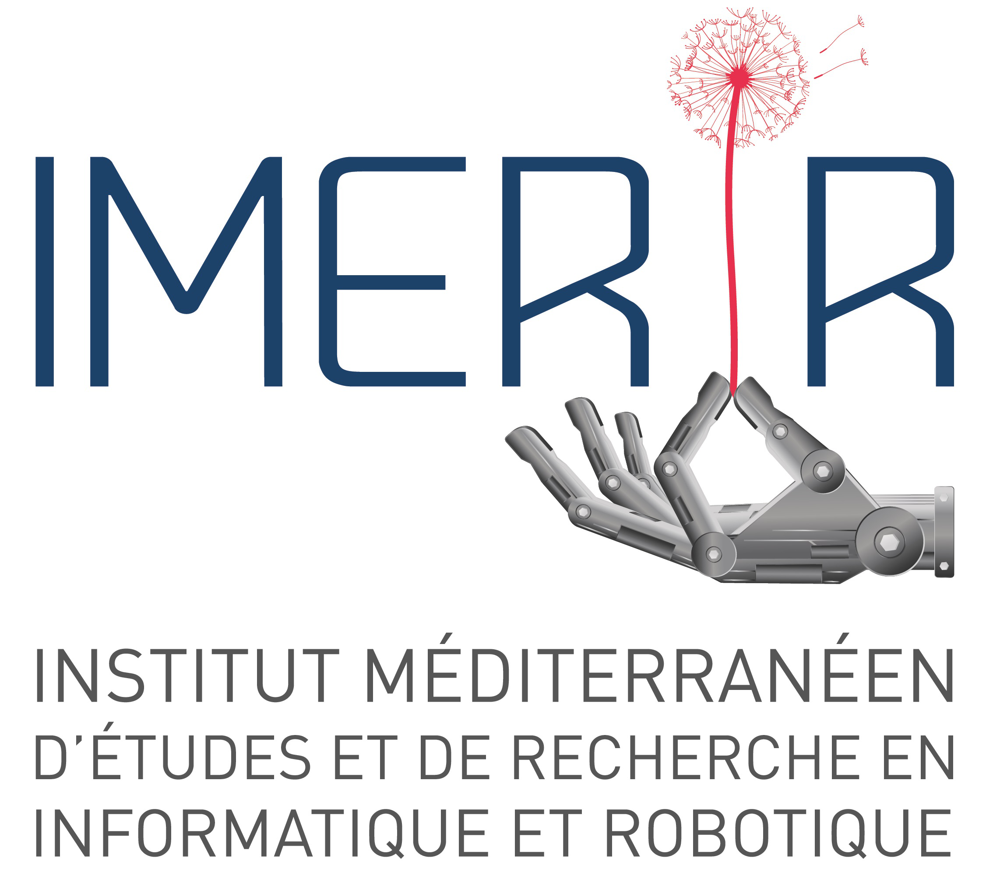

This school has a humanoid robot known as Pepper. Initially manufactured and marketed by the French company Aldebaran robotics, the production and marketing of Pepper was taken over by the Japanese company Softbank when the latter acquired Aldebaran robotics. Here is an image of this robot so emblematic of humanoid robotics:

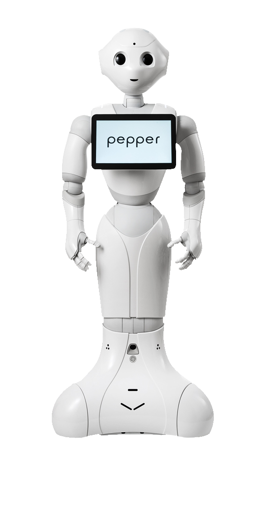

IMERIR uses the Pepper robot as the school mascot during various trade shows, meetings and professional forums focused on computer technologies and robotics as well as geek culture. 
As shown in some photos below, the Pepper robot from IMERIR is emulated wherever it goes.

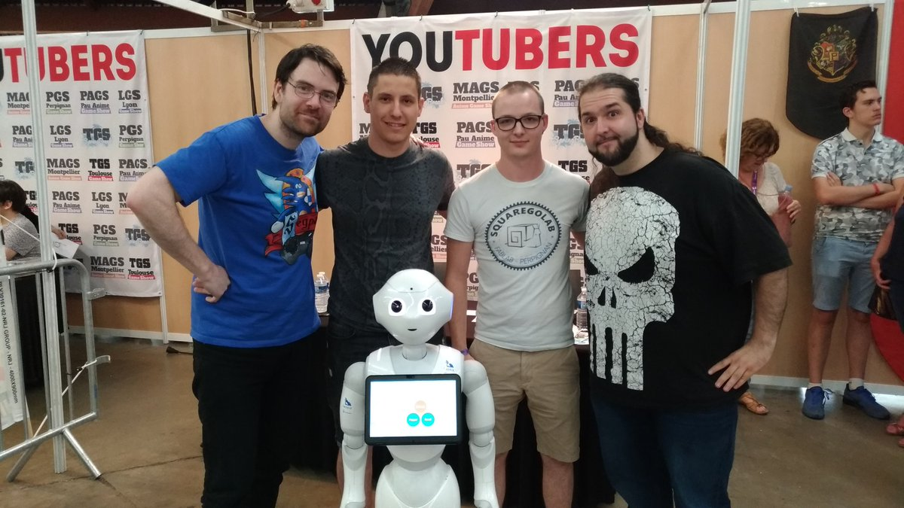

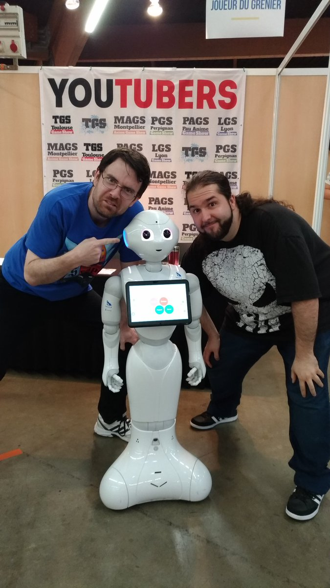

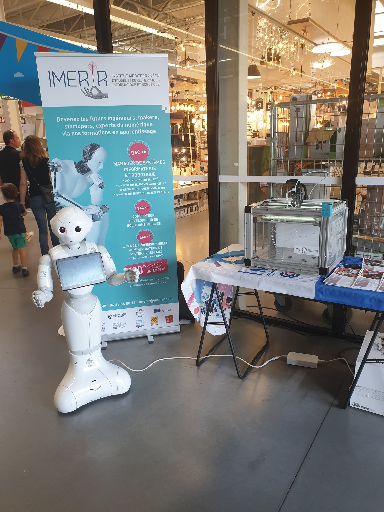

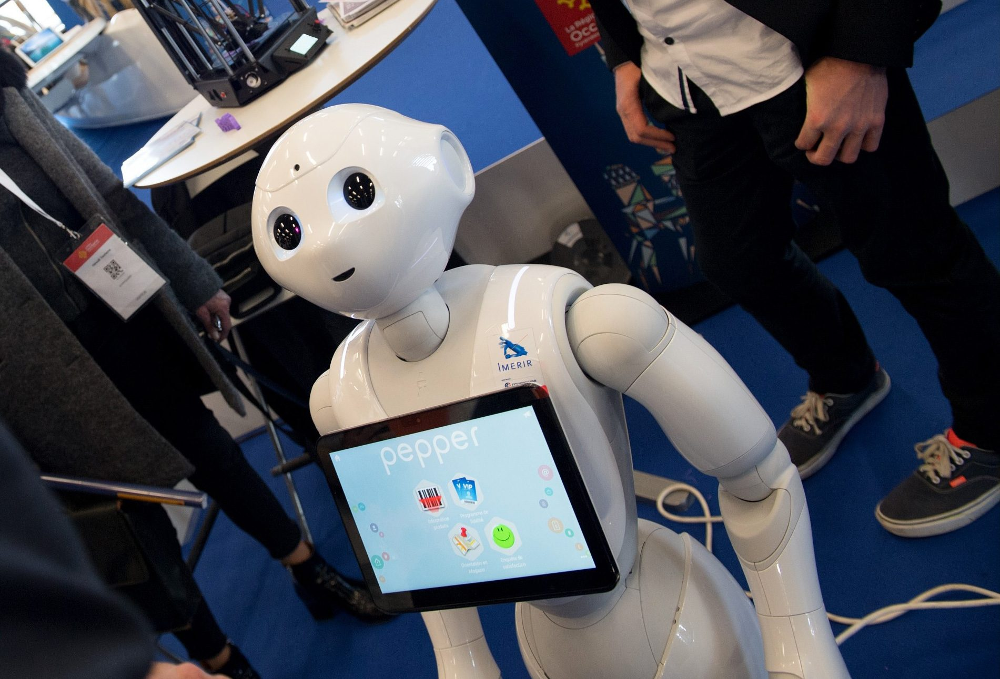

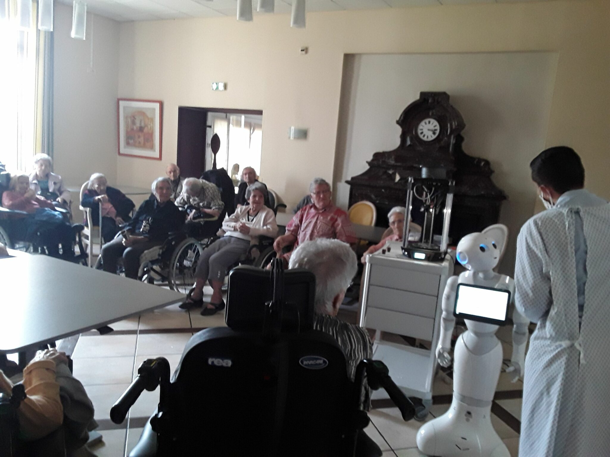

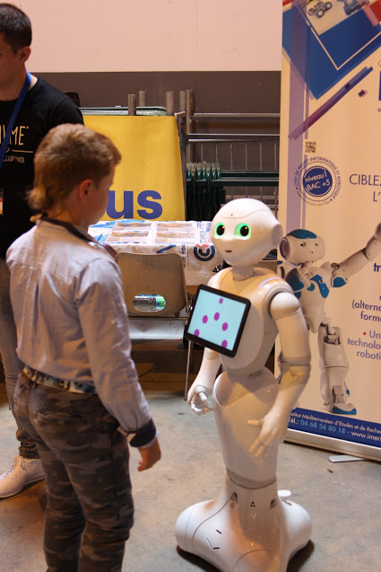

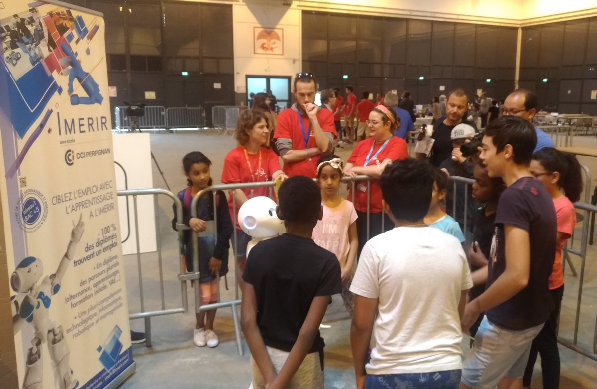

## Presentation of this project

This project consists to develop an application for the Pepper robot, to allow it to present the robotics and software engineering school named [IMERIR](https://www.imerir.com/). The presentation made by the robot is very complete and addresses all aspects of the school (small presentation, training, vocational education, Erasmus, graduation, alumni association...). This presentation of the school adopts a rigorous and complete organization thanks to the development (at the base) of the grafcet exposed below and which you can find [here](https://github.com/Vicken-Ghoubiguian/PepperPresentationIMERIRApp/blob/main/project_s_documentation/project_s_conception/Grafcet_of_IMERIR_presentation_app%20-%20final_version.png).

That's pretty cool... 🐱...

## Application's definition

This application is for the Pepper robot to permit it to present the IMERIR school to prospects, cosplayers, professionals and all other interested audiences.
This application:

* use the robot's voice command to allow the interlocutor to ask his question or state his answer,
* display graphical interfaces to allow the interlocutor to make his choice to ask his question or state his answer if there is too much noise,
* interact with the interlocutor using the voice interface while displaying well-designed graphical interfaces to illustrate the point,
* is based on a detailed scenario to explain and question with the corresponding graphical interfaces according to a well-written text,
* is based on a detailed grafcet to establish a rigorous order in the presentation of the explanations and the questions asked as well as the beginning and the end of the program.

__warning__: this application works exclusively on Pepper robots running on the version 2.5 of its OS NAOqi.

## Git repos's structure

Coming soon...

## How was this project developed ?

Developed on version 2.5 of NAOqi, Pepper's operating system, this application was developed using the Choregraphe software. Until version 2.8 of NAOqi, and therefore the development of the Pepper SDK on Android studio, the control, management and development of the Pepper robot was done by this software. Below, you can observe the interface of the Choregraphe software.

This application was developed exclusively for the version 2.5 of the Pepper's operating system NAOqi. For more information about requirements and application's definition, you can consult the application's manifest file [just here](https://github.com/Vicken-Ghoubiguian/PepperPresentationIMERIRApp/blob/main/PepperPresentationIMERIRApp/manifest.xml).

## Project's components

Coming soon...

## How to install it ?

Here, we will show you how to install the PepperPresentationIMERIRApp app on the Pepper robot. 
The process is common to all the other applications to be installed on Pepper, running with version 2.5 of the NAOqi system. So let's go...

1. Please turn on the Pepper robot first;

2. then wait for the robot to pronounce “Ognak Gnuk” and check its environment, this means that the robot is now on;

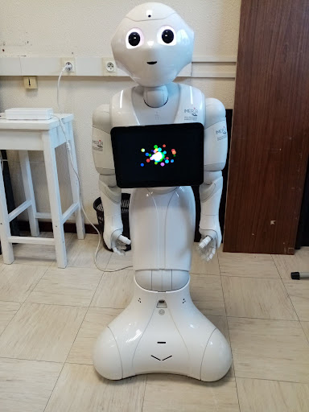

3. please connect the Pepper robot to the Choregraphe software now. You have to open the software in question to do this.

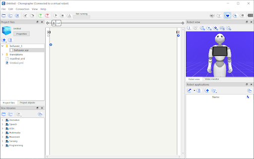

Then click on the button  indicated on the screenshot below.

The window shown in the screenshot below then opens.

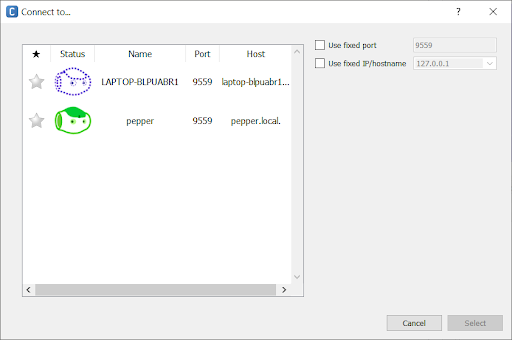

So please select the robot colored in green (or the one you want which is also colored in green) and then press the “Select” button as shown below.

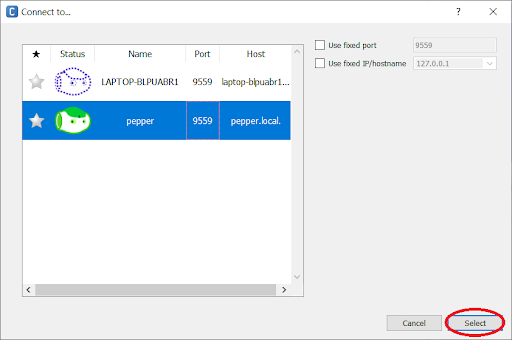

Let's go back to the interface shown above. In the table on the left, you must choose the robot you want to connect to Choregraphe. In the “status” column, there are several robots, each represented by a head of Nao robots. The dotted robot (opposite ) corresponds to the virtual robot, a simulation of the Pepper robot installed by default with Chorégraphe and which is just as interfaceable, controllable and programmable as a physical robot. A real physical Pepper robot is full line and:

* either it is colored green with the eyes open (opposite ): you can connect to this robot because its NAOqi OS is running,

* or it is colored red with closed eyes (opposite ): you cannot connect to this robot because its NAOqi OS is stopped.

4. Now is the time to install the application on the Pepper robot.

For more information, please refer to the Pepper robot user manual [just here](https://github.com/Vicken-Ghoubiguian/pepperApplications/raw/main/Manuel%20pour%20une%20prise%20en%20main%20rapide%20et%20efficiente%20du%20robot%20Pepper.pdf) (in french) at the question "Comment installer/réinstaller des applications sur le robot Pepper ?" ("How to install / reinstall applications on the Pepper robot ?" in english). You can also have just as ample information just here: https://github.com/Vicken-Ghoubiguian/pepperApplications#how_to_install_an_application_on_the_robot.

## Result

[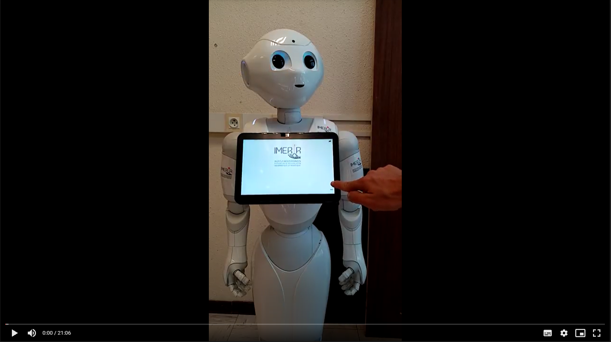](https://drive.google.com/file/d/1hlLouAGB8vXyBQcqV6g0pAuoxzXuEC5n/view)

## Manual

This section is the user guide for the application. All the questions you ask yourself about it are discussed there. 
So don't hesitate to take a look at it depending on the question you have, or the problem you are having.

### How to start the application ?

Coming soon...

### How to stop the application ?

To stop the application, you must be localized in the "Que veux-tu savoir sur notre établissement ?" question. To be located there, you can refer to the [application's grafcet](https://github.com/Vicken-Ghoubiguian/PepperPresentationIMERIRApp/blob/main/project_s_documentation/project_s_conception/Grafcet_of_IMERIR_presentation_app%20-%20final_version.png). You must then answer "stop" to this question, and the Pepper robot will state the message contained in the "Que veux-tu savoir sur notre établissement ?" box. And finally then, the application ends.

### Each answer for each question

#### "Que veux-tu savoir sur notre établissement ?"

- "stop" => "Message de remerciements, d'information et d'au revoir" box

- "IMERIR" => "Qui sommes nous ?" box

- "formations" => "Nos formations" box

- "alternance" => "L’alternance" box

- "professionnels" => "Professionnels" box

- "fablab" => "Le Fablab" box

- "association des anciens" => "Association des anciens" box

- "contact" => "Nous contacter" box

- "erasmus" => "Erasmus" box

- "diplôme" => "Remise des diplômes" box

- "admission" => "Admission" box

- "inscription" => "S'inscrire" box

#### "Quel diplôme t'intéresse ?"

- "stop" => ["Que veux-tu savoir sur notre établissement ?"](#first_question) question

- "cybersécurité" => "Cybersécurité" box

- "intelligence artificielle" => "Intelligence artificielle" box

- "internet des objets" => "Internet des objets" box

- "robotique" => "Robotique d'innovation" box

- "prépa" => "prepa" box

- "license" => "License informatique option robotique de prototypage" box

#### "Comment souhaites-tu prendre contact avec nous ?"

- "stop" => ["Que veux-tu savoir sur notre établissement ?"](#first_question) question

- "téléphone" => "Numéro de téléphone" box

- "formulaire" => "Formulaire" box

- "poste" => "Adresse postale" box

- "réseaux sociaux" => "Réseaux sociaux" box

- "i-mail" => "Adresse email" box

#### "Veux-tu en savoir plusse ?"

- "stop" => ["Que veux-tu savoir sur notre établissement ?"](#first_question) question

- "oui" => "Informations supplémentaires sur le fablab" box

- "non" => ["Que veux-tu savoir sur notre établissement ?"](#first_question) question

#### "Souhaites-tu remplir le formulaire d'inscription ?"

- "stop" => ["Que veux-tu savoir sur notre établissement ?"](#first_question) question

- "oui" => "Remplir le formulaire d'inscription et l'envoyer" box

- "non" => ["Que veux-tu savoir sur notre établissement ?"](#first_question) question

#### "Souhaites-tu voir des photos et vidéos de cérémonies ?"

- "stop" => ["Que veux-tu savoir sur notre établissement ?"](#first_question) question

- "oui" => "Remise des diplômes" box

- "non" => ["Que veux-tu savoir sur notre établissement ?"](#first_question) question

#### "L'IMÉRIR organise des sessions A R E; Veux-tu en savoir plusse ?"

- "stop" => ["Que veux-tu savoir sur notre établissement ?"](#first_question) question

- "oui" => "Sessions ARE (aide à la recherche d'entreprises)" box

- "non" => ["Que veux-tu savoir sur notre établissement ?"](#first_question) question

#### "Que veux-tu faire maintenant ? t'inscrire ? voir les partenaires ? ou rien ?"

- "stop" => ["Que veux-tu savoir sur notre établissement ?"](#first_question) question

- "partenaires" => "Les universités et écoles partenaires de l'IMERIR" box

### Issues and bugs

__Warning:__ By cloning this project from git on the Choregraphe software, a minimal bug is to be noted: by launching the application from the Choregraphe software (button ) or by installing it directly on the robot (button ) to launch it from the tablet, the robot crashes as soon as it executes a choice box (a block resembling that 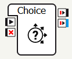 or that 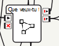 and allowing it to ask a question and answer orally). To remedy this problem (and so, __to run correctly the app on the robot__), you must then double-click on the choice box, copy the text of the question, delete it, save, then paste the text of this question again, then save again. This procedure is illustrated in the screenshots below...

1. clone the project from GitHub on your computer,

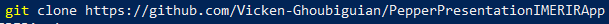

2. open the project on the Chorégraphe software (Please refer to the section named [How to install it ?](#how_to_install_it)),

3. click on the choice box in question (Here we will take the "Quel diplôme t'intéresse ?" one),

So the following interface is displayed.

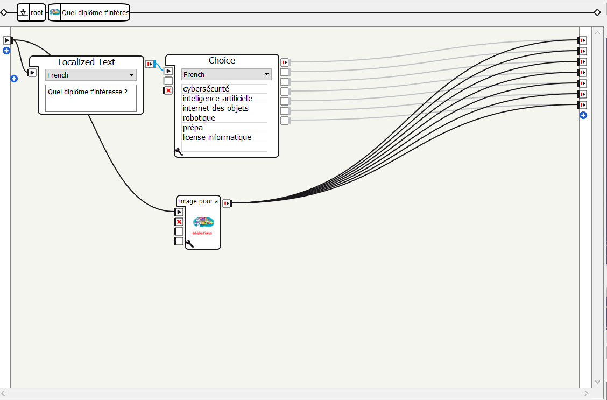

4. copy the text entered in the item titled "Localized text" (**ctrl + c**) as shown in the screenshot below.

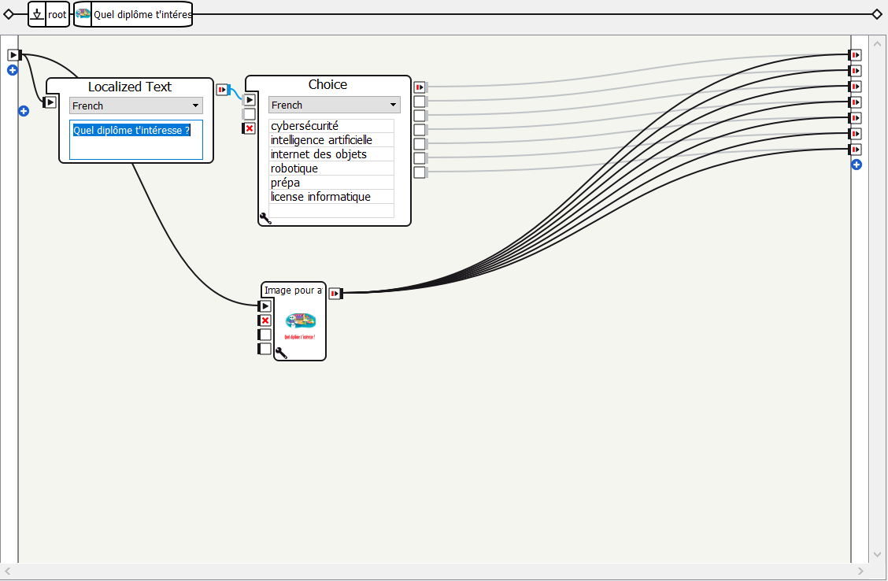

5. delete the text entered in the item titled "Localized text" and then save (**ctrl + s** or the button ), as shown in the screenshot below,

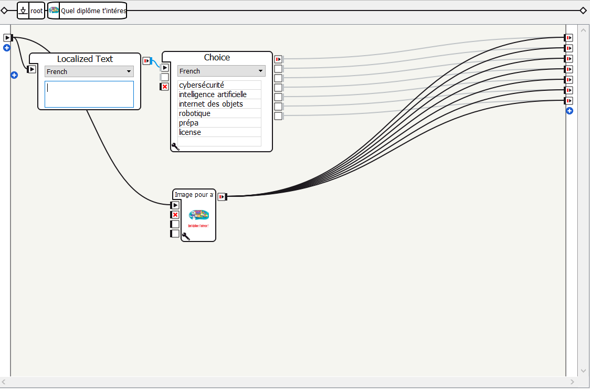

6. paste the text of the question (which you copied in step 4) still in the item titled "Localized text" (**ctrl + v**) and then save as explained on the screenshot below,

And here is the job ... the bug is solved as well 🐱. This operation must be repeated for all the choice boxes making up the application (8 in total).

## Useful links

* [IMERIR's official website](https://www.imerir.com/),
* [Documentation about the Choregraphe software](http://www.lirmm.fr/~seriai/uploads/Enseignement/CHOREGRAPHE.pdf),
* [Learn Choregraphe (for Pepper) - Level 1 - Introduction](https://www.youtube.com/watch?v=wSoGO1iL_v4&list=PLmXbV-2dNm40-19AfOc_0Ie_3hR-7nwMo),
* [Learn Choregraphe (for Pepper) - Level 2 - Special Topics](https://www.youtube.com/watch?v=tqVbX5NWFdU&list=PLmXbV-2dNm43SH6HG88LALwFPs2TQIGpa),

## Conclusion
